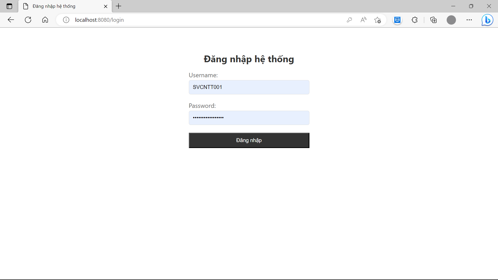
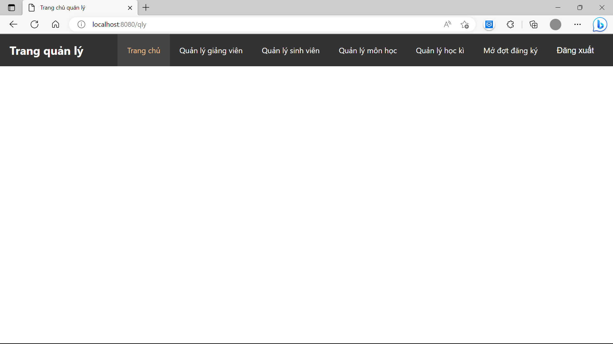
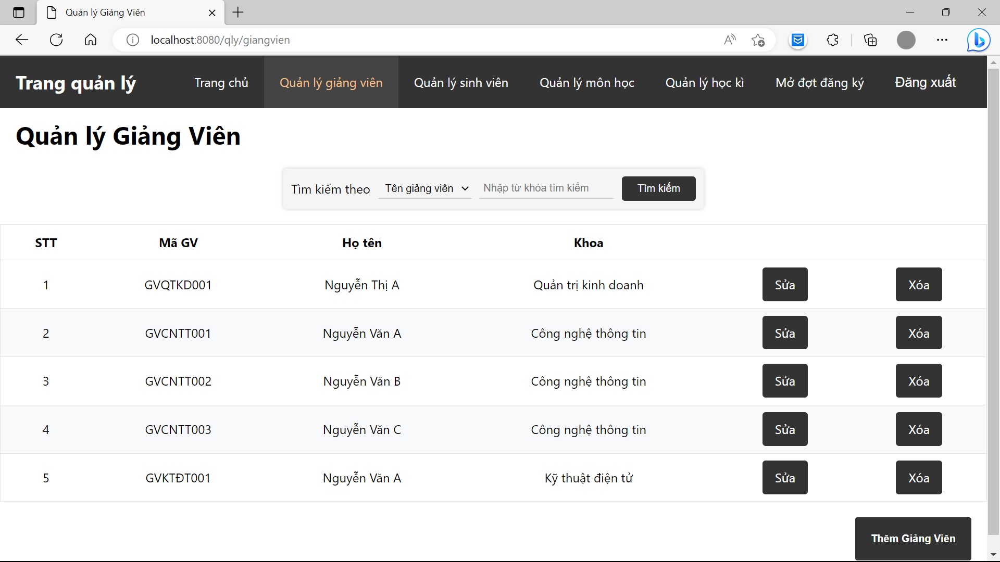
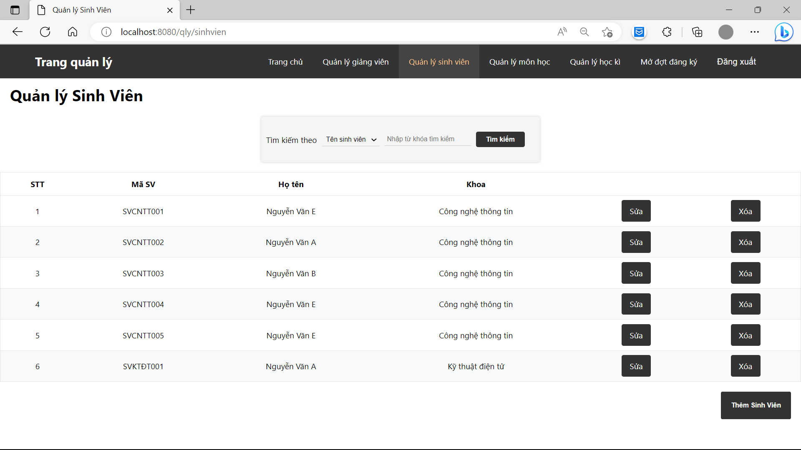
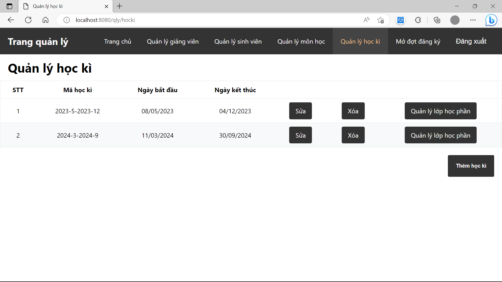
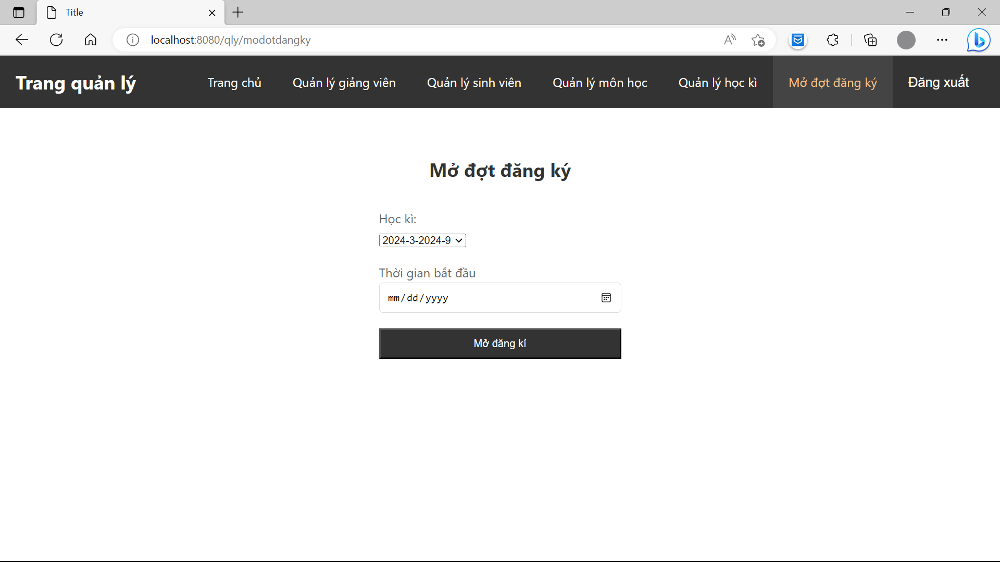

# BTL-LTW-QuanLyDaoTao

## Thành viên nhóm và phân công công việc

- Nguyễn Mạnh Dũng - B20DCCN138 - Các chức năng của người quản lý.
- Mai Huy Hoàng - - Các chức năng của giảng viên.
- Vương Trí Huy - - Các chức năng của sinh viên.

## Mô tả hệ thống và đặc tả các chức năng

### Mô tả hệ thống bằng ngôn ngữ tự nhiên

#### Mục đích, phạm vi của hệ thống:

- Kiểu ứng dụng: Dành cho máy tính, điện thoại có kết nối Internet và trình duyệt Web.
- Phạm vi: Nội bộ một tổ chức giáo dục.
- Chỉ có các nhân viên sau được dùng:
    - Người quản lý.
    - Sinh viên.
    - Giảng viên.

#### Người dùng và chức năng họ sẽ sử dụng:

**Người dùng (ND):**

- Đăng nhập
- Đăng xuất
- Đổi mật khẩu

**Quản lý (QL):**

- Các chức năng của người dùng (Trừ chức năng Đăng nhập do sẽ chỉ có một tài khoản QL)
- Quản lý sinh viên:
    - Thêm, sửa xóa
- Quản lý giảng viên:
    - Thêm, Sửa, Xóa
- Quản lý môn học:
    - Thêm, Sửa, Xóa
    - Thêm, Xóa giảng viên dạy môn này
- Quản lý học kì:
    - Thêm, Sửa, Xóa
    - Quản lý lớp học phần kì học đó:
        - Thêm, Sửa Xóa
        - Thêm, Xóa sinh viên trong lớp này
- Mở đợt đăng ký lớp học phần cho kì học chưa bắt đầu
  **Sinh viên (SV):**
- Các chức năng của người dùng.
- Xem kết quả các lớp học phần.
- Xem buổi học các lớp học phần.
- Đăng ký lớp học phần kì học được mở đăng ký.
  **Giảng viên (GV):**
- Các chức năng của người dùng.
- Xem buổi học các lớp học phần GV dạy.
- Nhập điểm cho các lớp học phần trong học kì đang hoạt động.

#### Chi tiết hoạt động từng chức năng:

- Quản lý sinh viên:
    - Trang quản lý sinh viên (/qly/sinhvien) gồm nút Thêm, thanh tìm kiếm theo tên hoặc MSV, nút Tìm, bảng kết quả tìm
      kiếm có
      các thông tin MSV, Tên, Khoa, trên mỗi dòng của bảng có nút "Sửa" và "Xóa"
    - Thêm:
        - Trang thêm sinh viên (/qly/sinhvien/them) gồm ô nhập họ tên, ngày sinh, cccd, email, sdt, dropdown menu chọn
          khoa.
        - Quản lý nhập đủ thông tin, ấn Thêm.
        - Hệ thống sinh MSV, username, password dựa trên thông tin được nhập, lưu thông tin vào CSDL.
    - Sửa:
        - Trang sửa sinh viên (/qly/sinhvien/sua/{idSinhVien}) gồm ô nhập họ tên, ngày sinh, cccd, email, sdt đã được
          điền sẵn
          thông tin cũ.
        - Quản lý nhập đủ thông tin, ấn Sửa.
        - Hệ thống lưu thông tin vào CSDL.
    - Xóa:
        - Trang xóa sinh viên (/qly/sinhvien/xóa/{idSinhVien}) hiển thị các thông tin họ tên, ngày sinh, cccd, email,
          sdt, khoa
          của sinh viên.
        - Quản lý ấn Xóa.
        - Hệ thống xóa thông tin trong CSDL.
- Quản lý giảng viên:
    - Trang quản lý giảng viên (/qly/giangvien) gồm nút Thêm, thanh tìm kiếm theo tên hoặc theo MGV, nút Tìm, bảng kết
      quả tìm kiếm có
      các thông tin MGV , Tên, Khoa, trên mỗi dòng của bảng có nút "Sửa" và "Xóa"
    - Thêm:
        - Trang thêm giảng viên (/qly/giangvien/them) gồm ô nhập họ tên, ngày sinh, cccd, email, sdt, dropdown menu chọn
          khoa.
        - Quản lý nhập đủ thông tin, ấn Thêm.
        - Hệ thống sinh MGV, username, password dựa trên thông tin được nhập, lưu thông tin vào CSDL.
    - Sửa:
        - Trang sửa giảng viên (/qly/giangvien/sua/{idGiangVien}) gồm ô nhập họ tên, ngày sinh, cccd, email, sdt đã được
          điền sẵn
          thông tin cũ.
        - Quản lý nhập đủ thông tin, ấn Sửa.
        - Hệ thống lưu thông tin vào CSDL.
    - Xóa:
        - Trang xóa giảng viên (/qly/giangvien/xoa/{idGiangVien}) hiển thị các thông tin họ tên, ngày sinh, cccd, email,
          sdt,
          khoa của sinh viên.
        - Quản lý ấn Xóa.
        - Hệ thống xóa thông tin trong CSDL.
- Quản lý môn học:
    - Trang quản lý giảng viên (/qly/monhoc) gồm nút Thêm, thanh tìm kiếm theo tên, nút Tìm, bảng kết quả tìm kiếm có
      các thông tin MSV, Tên, Ghi chú, Khoa, trên mỗi dòng của bảng có nút "Sửa" "Xóa", "Thêm Giảng viên" và "Xóa Giảng
      viên"
    - Thêm:
        - Trang thêm môn học (/qly/monhoc/them) gồm ô nhập tên môn học, dropdown menu chọn khoa, nút Thêm.
        - Quản lý nhập đủ thông tin ấn Thêm.
        - Hệ thống lưu thông tin vào CSDL.
    - Sửa:
        - Trang sửa giảng viên (/qly/monhoc/sua/{idMonHoc}) gồm ô nhập tên môn học đã được điền sẵn thông tin cũ.
        - Quản lý nhập đủ thông tin, ấn Sửa.
        - Hệ thống lưu thông tin vào CSDL.
    - Xóa:
        - Trang xóa giảng viên (/qly/monhoc/xoa/{idMonHoc}) hiển thị các thông tin mã môn học, tên môn học, khoa của môn
          học.
        - Quản lý ấn Xóa.
        - Hệ thống xóa thông tin trong CSDL.
    - Thêm giảng viên:
        - Trang thêm giảng viên (/qly/monhoc/themgiangvien/{idMonHoc}) bảng các giảng viên dạy môn học này (mã GV, tên,
          khoa), bảng các giảng viên không dạy môn học này (mã
          GV, tên, khoa, checkbox), nút "Xác nhận".
        - Quản lý chọn các giảng viên không dạy môn học này, ấn "Xác nhận".
        - Hệ thống lưu thông tin vào CSDL.
    - Xóa giảng viên:
        - Xóa thêm giảng viên (/qly/monhoc/xoagiangvien/{idMonHoc}) hiển thị các thông tin của môn học (tên, ghi chú,
          khoa),
          bảng các giảng viên dạy môn học này (mã GV, tên, khoa, checkbox).
        - Quản lý chọn các giảng viên dạy môn học này, ấn "Xác nhận".
        - Hệ thống lưu thông tin vào CSDL.
- Quản lý học kì:
    - Trang quản lý học kì (/qly/hocki) gồm các nút Thêm, thanh tìm kiếm theo mã hoặc khoa, nút Tìm, bảng kết quả tìm
      kiếm các
      học kì (mã, ngày bắt đầu, ngày kết thúc), trên mỗi dòng có nút Sửa, Xóa, Quản lý lớp học phần.
    - Thêm:
        - Trang thêm học kì (/qly/hocki/them) gồm ô nhập ngày bắt đầu (ngày kết thúc sẽ dựa vào đây
          để tính (mặc định 1 học kì 29 tuần)), nút Thêm
        - Quản lý nhập thông tin, ấn "Thêm"
        - Hệ thống lưu thông tin vào CSDL.
    - Sửa:
        - Trang thêm học kì (/qly/hocki/sua/{idHocKi}) gồm ô nhập ngày bắt đầu đã điền sẵn thông tin
          cũ, nút
          Sửa,
        - Quản lý nhập thông tin, ấn "Sửa"
        - Hệ thống lưu thông tin vào CSDL.
    - Xóa:
        - Trang thêm học kì (/qly/hocki/xoa/{idHocKi}) gồm thông tin học kì
        - Quản lý ấn "Xóa"
        - Hệ thống xóa thông tin trong CSDL.
    - Quản lý các lớp học phần:
        - Trang quản lý các lớp học phần (qly/hocki/{idHocKi}/lophocphan) gồm nút Thêm, bảng lớp học phần trong kì (
          khoa, môn, giảng viên, tên lớp học phần, ngày trong tuần, kíp trong ngày),
          trên mỗi hàng có nút Sửa, Xóa, Quản lý sinh viên.
        - Thêm lớp học phần:
            - Trang thêm lớp học phần (qly/hocki/{idHocKi}/lophocphan/them) gồm dropdown menu chọn khoa, dropdown menu
              chọn môn học, dropdown menu chọn giảng viên, ô nhập tên lớp học phần, dropdown menu chọn ngày trong tuần,
              dropdown menu chọn kíp trong ngày, dropdown menu chọn phòng học.
            - Qly nhập đủ thông tin ấn "Sửa"
            - Hệ thống lưu thông tin vào CSDL.
        - Sửa lớp học phần:
            - Quẳn lý ấn sửa một lớp học phần (qly/hocki/{idHocKi}/lophocphan/sua/{idLopHocPhan}) gồm dropdown menu chọn
              ngày trong tuần,
              dropdown menu chọn kíp trong ngày, dropdown menu chọn phòng học với thông tin cũ được điền sẵn
            - Qly nhập đủ thông tin ấn "Sửa"
            - Hệ thống lưu thông tin vào CSDL.
        - Xóa lớp học phần:
            - Qlý ấn xóa một lớp học phần (qly/hocki/{idHocKi}/lophocphan/xoa/{idLopHocPhan}) gồm các thông tin của lớp
              học phần.
            - Qly ấn "Xóa"
            - Hệ thống xóa thông tin trong CSDL.
        - Quản lý sinh viên:
            - Trang quản lý sinh viên trong lớp học phần (qly/hocki/{idHocKi}/lophocphan/sinhvien/{idLopHocPhan}) gồm
              nút thêm, bảng các sinh viên đang học trong lớp đấy, trên mỗi hàng có nút Xóa.
            - Qly ấn Xóa:
                - Hệ thống hiện trang xóa sinh viên khỏi lớp (
                  qly/hocki/{idHocKi}/lophocphan/sinhvien/{idLopHocPhan}/xoa/{idSinhVien})
                - Qly ấn Xóa
                - Hệ thống xóa thông tin trong CSDL
            - QLy ấn Thêm:
                - Trang thêm sinh viên (/qly/hocki/lophocphan/sinhvien/them) gồm thanh tìm kiếm theo tên, nút Tìm, bảng
                  kết
                  quả tìm kiếm theo tên/ mã sinh viên (các sinh viên khoa đó), trên mỗi hàng ô chọn, nút Thêm
                - Quản lý chọn các sinh viên mong muốn, ấn Thêm
                - Hệ thống lưu thông tin vào CSDL.
- Quản lý mở đợt đăng ký lớp học phần:
    - Trang mở đợt đăng ký (/qly/modotdangky) gồm ô chọn một học kì chưa bắt đầu, ô chọn ngày bắt đầu đăng ký.
- Sinh viên xem kết quả lớp học phần
    - Trang xem kết quả "/svien/ketqua" gồm một bảng các lớp học phần sinh viên đã học (kì học, môn học, điểm cc, kt1,
      kt2, thi, tổng kết)
- Sinh viên xem lịch học:
    - Trang xem lịch học "/svien/lichhoc" gồm một bảng thể hiện lịch học của học kì đang hoạt động có các cột là ngày
      trong tuần, các hàng là kíp trong ngày,
- Sinh viên đăng ký lớp học phần.
- Giảng viên xem lịch dạy:
    - Trang xem lịch học "/gvien/lichday" gồm một bảng thể hiện lịch học của học kì đang hoạt động có các cột là ngày
      trong tuần, các hàng là kíp trong ngày,
- Giảng viên nhập điểm:
    - Trang nhập điểm "/gvien/nhapdiem" gồm danh sách lớp học phần (trong học kì hiện tại) theo tên trên mỗi hàng có
      nút "Xem".
    - GV ấn "Xem" trên một hàng.
    - Trang nhập điểm lớp học phần "/gvien/nhapdiem/lophocphan/{id} hiện ra gồm danh sách các sinh viên trong lớp, trên
      mỗi hàng có nút "Nhập điểm".
    - GV ấn nhập điểm một sinh viên.
    - Trang nhập điểm sinh viên hiện ra gồm các ô nhập các đầu điểm cho svien. Nút lưu
    - GV nhập thông tin và ấn lưu.
    - Hệ thống lưu thông tin vào CSDL.

#### Các thông tin cần phải xử lý:

- Khoa: Mã khoa, Tên khoa.
- Quản lý: username, password, họ tên, ngày sinh, CCCD, email, sđt.
- Sinh viên: username, password, mã SV, họ tên, ngày sinh, CCCD, email, sđt.
- Giảng viên: username, password, mã GV, họ tên, ngày sinh, CCCD, email, sđt.
- Học kì: Mã kì học, ngày bắt đầu, ngày kết thúc, trạng thái mở đăng ký.
- Môn học: Mã môn học, tên môn học.
- Lớp học phần: Mã lớp học phần, ngày trong tuần, phòng học.
- Kết quả lớp học phần: Điểm CC, KT1, KT2, Thi.

#### Quan hệ giữa các thông tin cần phải xử lý:

- Một khoa có nhiều giảng viên.
- Một khoa có nhiều sinh viên.
- Một khoa có nhiều môn học.
- Một môn học có nhiều lớp học phần trong một kì học.
- Một lớp học phần có nhiều sinh viên, một sinh viên học nhiều lớp học phần.
- Một lớp học phần được dạy bởi một giảng viên.
- Một sinh viên và một lớp học phần có một kết quả học phần

### Mô tả hệ thống bằng UML

#### Biểu đồ Use Case tổng quan:

## Phân tích:

### Trích lớp:

- Các lớp ban đầu: Khoa, QuanLy, GiangVien, SinhVien, MonHoc, HocKi, LopHocPhan, KetQuaHocPhan.

### Xét quan hệ số lượng giữa các lớp

- Khoa 1-n GiangVien
- Khoa 1-n SinhVien
- Khoa 1-n MonHoc
- MonHoc n-n GiangVien
  => MonHoc 1-n GiangVienMonHoc n-1 GiangVien
- MonHoc n-n HocKi
  => MonHoc 1-n LopHocPhan n-1 HocKi
- LopHocPhan n-n SinhVien
  => LopHocPhan 1-n KetQuaHocPhan n-1 SinhVien

### Xét quan hệ đối tượng giữa các lớp

- Khoa nằm trong GiangVien, SinhVien, MonHoc.
- GiangVien, MonHoc nằm trong GiangVienMonHoc.
- GiangVienMonHoc, HocKi nằm trong LopHocPhan.
- LopHocPhan nằm trong KetQuaHocPhan
- KetQuaHocPhan nằm trong SinhVien.

### Biểu đồ lớp:

## Thiết kế:

## Kiến trúc hệ thống

Hệ thống sẽ được thiết kế theo kiến trúc Monolith dùng mô hình MVC

### Các công nghệ sử dụng

#### Các công nghệ hỗ trợ phát triền:

    - Lombok
    - SpringBoot Dev Tools

#### Các công nghệ chính:

    - SpringWeb
    - SpringSecurity
    - SpringDataJPA
    - Thymeleaf
    - MySQL

## Một vài hình ảnh về hệ thống:

### Trang đăng nhập

### Quản lý

#### Trang chủ quản lý:

#### Trang quản lý giảng viên:

#### Trang quản lý sinh viên:

#### Trang quản lý môn học:

#### Trang quản lý học kì

#### Trang mở đợt đăng ký

### Giảng viên

### Sinh viên
